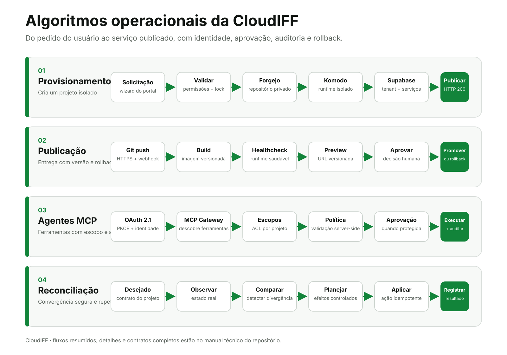
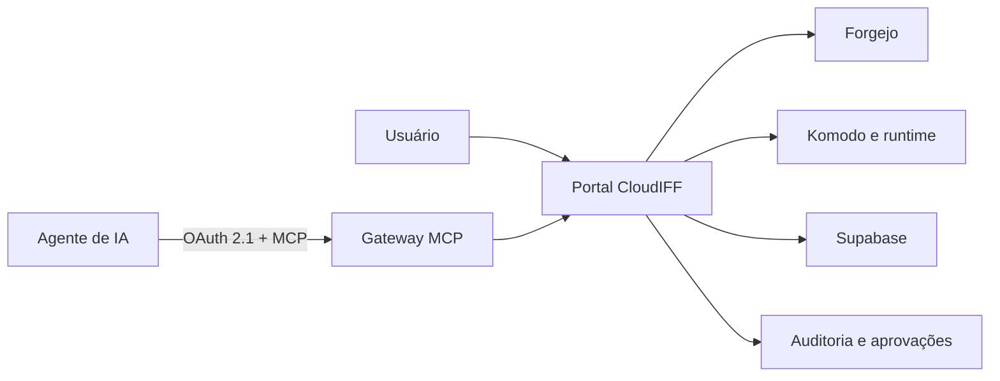

# CloudIFF

Plataforma institucional para **criar, publicar e administrar projetos web isolados** em um fluxo único. A CloudIFF reúne identidade, repositório Git, runtime, banco Supabase, publicação, agentes MCP, permissões, backup e observabilidade sem misturar recursos ou credenciais entre projetos.

## O que é e para que serve

A CloudIFF automatiza o caminho entre a criação de um projeto e sua disponibilização em produção. Em vez de configurar manualmente repositório, container, banco, domínio, permissões e ferramentas de IA, o usuário solicita o projeto pelo portal e a plataforma reconcilia todos esses recursos de forma auditável.

Ela foi projetada para:

- **estudantes**, que precisam desenvolver e publicar aplicações sem administrar a infraestrutura;
- **professores**, que acompanham projetos, permissões, entregas e backups;
- **equipes de desenvolvimento**, que usam Git, Supabase, ambientes versionados e agentes MCP;
- **TI**, que mantém políticas, isolamento, observabilidade, aprovações e recuperação.

## O que a plataforma entrega

| Capacidade | Resultado para cada projeto |
|---|---|
| Código | Repositório privado no Forgejo, acessível por Git HTTPS. |
| Runtime | Runtime gerado fora do Git, com Apache, PHP e Node.js nas versões escolhidas. |
| Dados | Tenant Supabase com Postgres, Auth, REST, Storage, Realtime e Studio. |
| Publicação | Cada `dN` possui stack, imagem, container, URL e terminais próprios, com promoção e rollback pelo Komodo. |
| Agentes de IA | Identidade MCP própria, OAuth, escopos, ACL, aprovação humana e auditoria. |
| Governança | Permissões por projeto, backups, logs, monitoramento e reconciliação idempotente. |

## Contrato de um projeto

O repositório de cada projeto guarda somente o código-fonte e sua documentação. A antiga pasta `site/` passa a ser a própria raiz do Git:

```text
index.php ou index.html
api/
assets/
src/
README.md
```

Arquivos operacionais da CloudIFF não são enviados ao Forgejo. Dockerfile, Compose, configuração de Apache e Supervisor, healthcheck, imagens, `.env`, segredos e metadados são gerados fora do repositório.

Cada publicação é um runtime imutável e independente:

```text
d1 → stack + imagem + container + URL + terminais
d2 → stack + imagem + container + URL + terminais
dN → stack + imagem + container + URL + terminais
```

A ativação troca somente o alias da versão estável depois do healthcheck. Se o runtime de uma versão registrada não existir mais, a plataforma reconstrói o commit daquela `dN` antes de promovê-la.

Quando uma pessoa é adicionada ou removida de um projeto ou banco, o reconciliador reaplica o estado completo: colaboradores do Forgejo, permissões do Komodo, terminais das publicações, integrações MCP e acesso ao tenant Supabase. Operações pendentes permanecem na fila e são repetidas até a convergência.

### Conclusão do provisionamento

O job não termina quando os containers apenas aparecem. Para concluir, ele exige:

- serviços críticos do tenant presentes, em execução e saudáveis;
- certificado e rota HTTPS do tenant válidos;
- stack, imagem e container próprios da `d1` saudáveis;
- URL imutável da `d1` e URL estável respondendo;
- terminal e associações do projeto reconciliados.

Projetos novos recebem uma página inicial que ensina a publicar, clonar o Forgejo por HTTPS no Linux e Windows e consumir o Supabase em aplicações desktop por `supabase-js` ou REST HTTPS. O Portal também oferece tema **Claro**, **Escuro** ou **Sistema**, persistido no navegador.

## Algoritmos operacionais



O diagrama resume os quatro algoritmos centrais da plataforma:

1. **Provisionamento:** valida a solicitação, cria o repositório somente com código na raiz e permanece em execução até o tenant, a rota HTTPS e a publicação inicial `d1` estarem realmente prontos.
2. **Publicação:** transforma um commit em uma nova `dN`, com imagem, container, URL e terminais independentes, pronta para promoção ou rollback.
3. **Agentes MCP:** autentica o cliente, aplica escopos e ACL, solicita aprovação quando necessário e audita a execução.
4. **Reconciliação:** reage a mudanças de projeto, banco e membresia, compara o estado desejado com o observado e repete correções idempotentes até convergir.

Os contratos completos estão em [Arquitetura e diagramas](docs/manual-tecnico/01-ARQUITETURA.md), [Fluxos de processo](docs/manual-tecnico/02-FLUXOS.md) e [Arquitetura operacional atual](docs/manual-tecnico/12-ARQUITETURA-OPERACIONAL-ATUAL.md).

## Interface do portal


> Visão representativa da interface versionada no repositório. O acesso ao ambiente real exige autenticação institucional.

## Fluxo principal



## Exemplo provisionado: Laboratório de Hardware

| Recurso | Endereço público homologado |
|---|---|
| Repositório Forgejo | `https://cloudiff.duckdns.org/git/iff1742962/cloudif-laboratorio-de-hardware` |
| Clone Git por HTTPS | `https://cloudiff.duckdns.org/git/iff1742962/cloudif-laboratorio-de-hardware.git` |
| Supabase | `https://iff1742962-laboratoriodehardware.cloudiff.duckdns.org` |
| Komodo | `https://komodoiff.duckdns.org/` |
| MCP da plataforma | `https://cloudiff.duckdns.org/cloudiff/mcp` |

Esses endereços atendem aplicações web e mobile, `supabase-js`, REST/PostgREST, Auth, Storage, Realtime, Edge Functions, Supabase Studio, Git CLI, VS Code, IDEs, painel e integrações HTTPS do Komodo e clientes MCP HTTP autorizados.

> Outras formas de conexão devem ter compatibilidade, segurança e liberação verificadas com a TI. Nunca publique senhas, tokens ou chaves privadas.

## Conectar agentes MCP

O endpoint remoto é compartilhado pela plataforma; a autorização e as ferramentas são filtradas pela identidade e pela ACL de cada projeto.

```bash
claude mcp add --scope project --transport http \
  --client-id "<CLIENT_ID_DO_PROJETO>" --client-secret \
  cloudiff "https://cloudiff.duckdns.org/cloudiff/mcp"

claude mcp login cloudiff
```

Para integrações que também precisam da API Supabase do projeto:

```bash
export NEXT_PUBLIC_SUPABASE_URL="https://iff1742962-laboratoriodehardware.cloudiff.duckdns.org"
```

O `Client ID` e o `Client Secret` são emitidos na aba **Agentes de IA** para cada projeto. O segredo é solicitado de forma mascarada pelo Claude Code e não deve ser salvo no README. O fluxo OAuth aceita callbacks HTTPS conhecidos e callbacks locais temporários, como `http://127.0.0.1:<porta>/`, usados por clientes desktop. O callback local não precisa ser publicado no roteador.

## Acesso externo

As integrações homologadas usam os endereços HTTPS publicados pela CloudIFF:

- Supabase para aplicações, APIs, autenticação, arquivos, eventos e funções;
- Forgejo para clone, pull e push por Git HTTPS;
- Komodo para painel e integrações HTTPS autorizadas;
- MCP para clientes HTTP autenticados por OAuth e ACL do projeto.

A configuração de infraestrutura e os métodos que dependem de análise da TI estão documentados em [Acesso externo e conexões](docs/manual-tecnico/13-ACESSO-EXTERNO.md).

## Documentação técnica

Este repositório funciona também como uma apostila técnica da plataforma:

- [Manual técnico completo](docs/manual-tecnico/README.md)
- [Acesso externo e conexões](docs/manual-tecnico/13-ACESSO-EXTERNO.md)
- [Arquitetura e diagramas](docs/manual-tecnico/01-ARQUITETURA.md)
- [Runtime unificado de projetos](docs/manual-tecnico/11-RUNTIME-UNIFICADO.md)
- [Arquitetura operacional atual](docs/manual-tecnico/12-ARQUITETURA-OPERACIONAL-ATUAL.md)
- [Fluxos de processo](docs/manual-tecnico/02-FLUXOS.md)
- [Agentes e funções](docs/manual-tecnico/03-AGENTES.md)
- [Protocolos de reconciliação](docs/manual-tecnico/04-RECONCILIACAO.md)
- [Modelo e dicionário de dados](docs/manual-tecnico/05-DADOS.md)
- [Mensagens, aprovações e segurança](docs/manual-tecnico/06-MENSAGENS-E-APROVACOES.md)
- [Catálogo de agentes](docs/CATALOGO-DE-AGENTES.md)
- [Catálogo de serviços](docs/CATALOGO-DE-SERVICOS.md)
- [Catálogo de rotas](docs/CATALOGO-DE-ROTAS.md)
- [Inventário de todos os arquivos](docs/INVENTARIO-DE-ARQUIVOS.md)

## Componentes versionados

Este snapshot reúne o código-fonte e as configurações versionáveis dos três nós da plataforma:

- **control-plane**: Portal, MCP, AuthZ, tenant guard, reconciliadores, monitores e testes;
- **runtime**: Komodo, agentes, stacks e serviços de execução;
- **proxy**: proxy reverso, configurações customizadas e automações;
- **tenant-templates**: templates, scripts, testes e composições dos tenants Supabase.

## Vídeos de apresentação

- [Apresentação rápida da CloudIFF](https://youtu.be/cxH3K8s1R9M)
- [Demonstração prática da plataforma](https://youtu.be/pJ7mx3VZuWU)

## Estrutura

```text
components/
  control-plane/
    current-apps/       Releases atuais dos serviços
    srv/cloudif/lib/    Bibliotecas compartilhadas
    srv/cloudif/tests/  Testes e gates
    srv/cloudif/router/ Configuração do roteador
    usr/local/sbin/     Automação operacional
    etc/systemd/system/ Unidades e timers
  runtime/
    current-apps/       Releases atuais do runtime
    etc/komodo/stacks/  Stacks versionáveis
    usr/local/sbin/     Agentes e automações
    etc/systemd/system/ Unidades e timers
  proxy/
    current-apps/       Releases atuais do proxy
    srv/cloudif/proxy/  Configuração customizada do Nginx
    usr/local/sbin/     Automações
    etc/systemd/system/ Unidades e timers
tenant-templates/
  srv/cloudif/tenants/  Templates sanitizados dos tenants
```

## Segurança

Este repositório não contém senhas, tokens, chaves privadas, arquivos `.env`, certificados, bancos, logs, backups, volumes ou snapshots publicados. Valores sensíveis devem ser injetados por variáveis de ambiente ou pelo gerenciador de segredos da infraestrutura.

## Validação e manutenção

Antes de enviar alterações:

```bash
scripts/validate.sh
```

Consulte [Manutenção](docs/MAINTENANCE.md), [Auditoria do repositório](docs/REPOSITORY_AUDIT.md), [Cobertura](docs/COVERAGE_AUDIT.json) e [Inventário](docs/INVENTORY.json).

## Portal v2

A migração incremental do Portal está em `portal/`. Consulte o [plano de aperfeiçoamento](docs/portal-v2/PLANO-DE-APERFEICOAMENTO.md), o [guia de migração](docs/portal-v2/GUIA-DE-MIGRACAO.md) e o [protótipo](docs/portal-v2/prototipo.html). O Portal legado permanece como fallback até a promoção individual das rotas.

<!-- CLOUDIFF-AUTO-DOC:BEGIN -->

## Inventário automático de `.`

Diretório versionado da CloudIFF.

| Item | Tipo | Finalidade |
|---|---|---|
| [`.github/`](.github/) | Diretório | Automação e integração contínua do GitHub. |
| [`components/`](components/) | Diretório | Diretório versionado da CloudIFF. |
| [`config/`](config/) | Diretório | Configurações por nó e contratos declarativos. |
| [`docs/`](docs/) | Diretório | Documentação técnica, inventários e evidências. |
| [`portal/`](portal/) | Diretório | Arquitetura modular, interface, configuração e testes do Portal. |
| [`scripts/`](scripts/) | Diretório | Ferramentas de validação, documentação e manutenção do repositório. |
| [`tenant-templates/`](tenant-templates/) | Diretório | Modelos e snapshots de tenants Supabase. |
| [`.gitignore`](.gitignore) | `arquivo` | Arquivo de suporte da plataforma. |
| [`SECURITY.md`](SECURITY.md) | `.md` | Documento técnico ou operacional. |

> Esta seção é gerada por `scripts/generate-directory-readmes.py`. Conteúdo manual fora dos marcadores é preservado.

<!-- CLOUDIFF-AUTO-DOC:END -->
