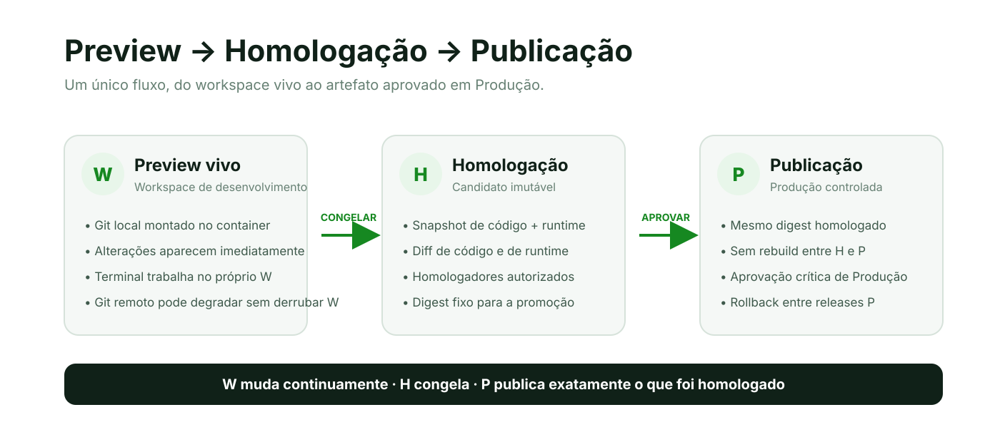
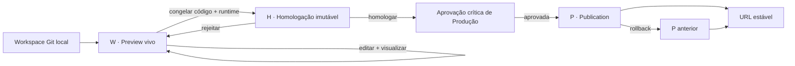

# Fluxo W → H → P de publicação

A CloudIFF separa desenvolvimento, validação e produção em três estágios explícitos: **W · Preview**, **H · Homologação** e **P · Publicação**. O objetivo é permitir desenvolvimento contínuo sem transformar cada alteração em uma release e, ao mesmo tempo, garantir que Produção receba exatamente o artefato que foi homologado.



## Resumo

| Estágio | Significado | Natureza | Função principal |
|---|---|---|---|
| **W** | Workspace / Preview | Vivo e mutável | Desenvolver e visualizar alterações imediatamente. |
| **H** | Homologation / Homologação | Imutável | Congelar código + runtime e obter aprovação funcional. |
| **P** | Publication / Publicação | Imutável e controlada | Colocar em Produção exatamente o artefato homologado. |

A regra central é simples:

> **W muda continuamente; H congela; P publica o mesmo digest de H, sem rebuild.**

## W · Preview vivo

O Preview é o ambiente de trabalho contínuo do projeto. O workspace Git local gerenciado pela CloudIFF é montado no container W; por isso, alterações no código aparecem no endereço do Preview sem criar uma nova versão a cada edição.

Características do W:

- possui um container próprio, por exemplo `cloudif-p1007-w1-preview-web`;
- usa hostname no formato `<numero>-w<N>-preview.cloudiff.duckdns.org`;
- monta o checkout Git local no runtime;
- usa as variáveis do ambiente **Preview**;
- oferece terminal no próprio container W;
- bloqueia exposição pública de `.git`, `.env` e metadados equivalentes;
- pode ser recriado a partir da Produção ativa ou do template, preservando o workspace Git;
- não cria H ou P automaticamente.

### Git indisponível

O Preview é **fail-soft** para indisponibilidade do remoto Git. Se Forgejo ou a rede estiverem temporariamente indisponíveis e existir uma cópia local válida, W continua no ar e o usuário recebe uma mensagem de sincronização degradada.

Esse modo degradado não autoriza uma promoção silenciosa. A criação de H exige novamente validação da procedência do código. Se o remoto estiver indisponível ou houver conflito entre alterações locais e remotas, o envio para Homologação é bloqueado até a situação ser reconciliada.

## H · Homologação imutável

Quando o Preview está pronto para validação, a ação **Enviar Preview para homologação** congela o estado atual em um candidato H.

O snapshot inclui:

- commit Git sintético do estado exato do workspace, sem alterar a branch de trabalho do usuário;
- imagem do runtime do Preview;
- digest da imagem;
- revisão e digest das variáveis de **Homologação**;
- diff de código;
- resumo das alterações relevantes do runtime;
- identificação do Preview de origem, como `W1`.

O hostname segue o padrão `<numero>-h<N>-homologation.cloudiff.duckdns.org`.

Depois da criação, H é imutável. O desenvolvedor pode continuar alterando W sem modificar o candidato que está sendo homologado.

### Homologadores

O responsável pelo projeto pode definir homologadores adicionais. A autorização para homologar é específica do projeto e não transforma automaticamente a pessoa em administradora da plataforma.

Um candidato pode ficar em estados como:

- `awaiting_homologation`;
- `homologated`;
- `rejected`;
- `published`.

## P · Publicação controlada

Produção não recompila o projeto. P inicia um novo container a partir da **mesma imagem/digest do candidato H homologado** e aplica a configuração do ambiente **Production**.

Isso garante a propriedade principal do fluxo:

```text
artefato testado em H == artefato executado em P
```

O hostname de uma release P segue `<numero>-p<N>-publication.cloudiff.duckdns.org`. O endereço estável do projeto continua apontando somente para a P ativa.

### Aprovação crítica de Produção

Homologação funcional e autorização de Produção são controles diferentes. Após H ser homologada, a ativação P continua protegida pela ação crítica `deployment.production.activate`.

A solicitação de Produção fica vinculada a:

- projeto;
- candidato H;
- número P reservado;
- commit congelado;
- digest exato do artefato homologado;
- revisão do ambiente Production;
- digest da configuração Production.

Quando a política exigir dupla aprovação, dois aprovadores privilegiados e distintos devem autorizar a ativação. A aprovação é reservada durante a execução e consumida somente depois do sucesso da publicação.

## Variáveis por ambiente

Preview, Homologação e Produção mantêm configurações independentes:

```text
preview       → configuração usada por W
homologation  → configuração congelada com H
production    → configuração aplicada ao criar P
```

Valores públicos podem ser exibidos conforme a política do Portal. Segredos são tratados por referência, resolvidos internamente na execução e não devem aparecer no Git, no MCP, em logs de publicação ou no HTML do Portal.

## Terminal

O terminal padrão do projeto prioriza o Preview W quando ele existe. Isso faz com que a personalização de runtime e o desenvolvimento ocorram no mesmo ambiente que o usuário está visualizando.

Fluxo atual:

```text
Abrir terminal
    ↓
W existe e está saudável?
    ├─ sim → terminal do container W
    └─ não → fluxo legado de compatibilidade
```

A URL do terminal é validada pelo Portal e deve apontar para `https://komodoiff.duckdns.org/.../terminal/...`.

## Rollback

Cada release P permanece imutável. O rollback não reconstrói uma versão antiga; ele reativa uma P previamente registrada e saudável e atualiza o alias estável.

A troca de P ativa é separada da existência do artefato. Isso reduz o tempo de recuperação e mantém rastreabilidade sobre qual candidato H originou cada publicação.

## Nomenclatura pública

Para um projeto com número público `1007`, exemplos de URLs são:

```text
W1  https://1007-w1-preview.cloudiff.duckdns.org/
H2  https://1007-h2-homologation.cloudiff.duckdns.org/
P2  https://1007-p2-publication.cloudiff.duckdns.org/
P    https://1007.cloudiff.duckdns.org/        # endereço estável
```

Os números acima são ilustrativos; cada projeto possui sua própria sequência.

## Compatibilidade com `dN`

`dN` continua existindo como identificador técnico interno/legado de artefatos e para compatibilidade com publicações anteriores. Ele não é mais o vocabulário principal da interface.

Durante a migração:

- uma publicação histórica `d1` pode ser apresentada ao usuário como **P1 legado**;
- novos candidatos usam H;
- novas ativações usam P;
- URLs `dN` podem continuar disponíveis em **Detalhes técnicos e versões legadas**;
- atalhos antigos de publicação direta não devem contornar H e a aprovação crítica de P.

## Fluxo completo



## Contratos operacionais

A implementação se distribui entre:

- **Portal/control-plane:** estado W/H/P, wizard, homologadores, jobs, aprovação e rollback;
- **Komodo Agent/runtime:** container W, snapshot W→H, criação P a partir do digest homologado e terminais;
- **Publisher/proxy:** certificados e hostnames W/H/P;
- **publication gateway:** roteamento dos hostnames para os containers corretos.

Endpoints internos relevantes incluem:

```text
/komodo/project/preview/status
/komodo/project/preview/ensure
/komodo/project/preview/recreate
/komodo/project/preview/terminal
/komodo/project/preview/snapshot
/komodo/publication/release
/komodo/publication/release/activate
```

Esses endpoints são internos à plataforma e não substituem autenticação, ACL, CSRF, aprovação humana ou o Portal.

## Regra para novas evoluções

Qualquer evolução do sistema de entrega deve preservar estes invariantes:

1. W pode mudar sem gerar release.
2. H é imutável depois de criada.
3. P usa o mesmo digest homologado, sem rebuild.
4. Produção continua sujeita à autorização crítica.
5. Segredos não entram no Git nem nas respostas do Portal.
6. Falha do Git remoto não derruba um W local saudável.
7. `dN` permanece apenas como compatibilidade técnica até sua remoção planejada.
