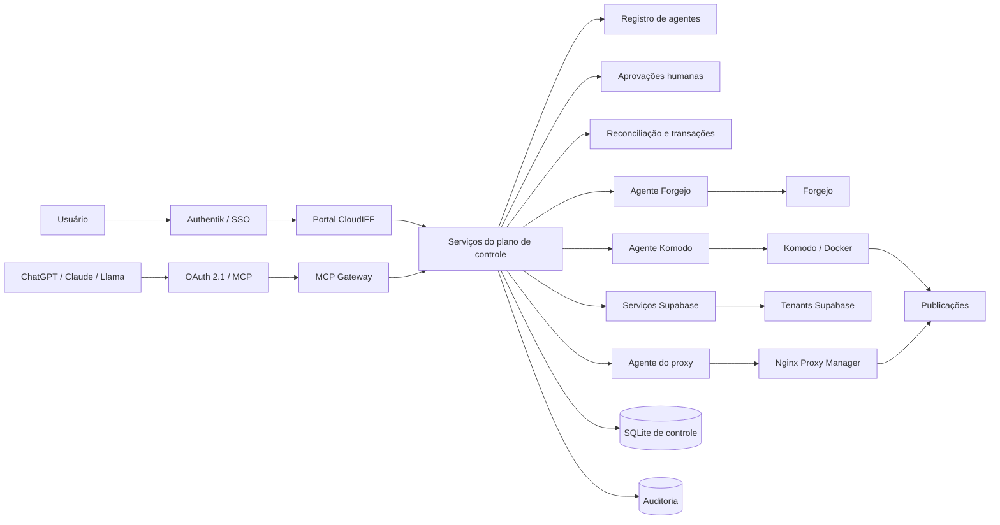
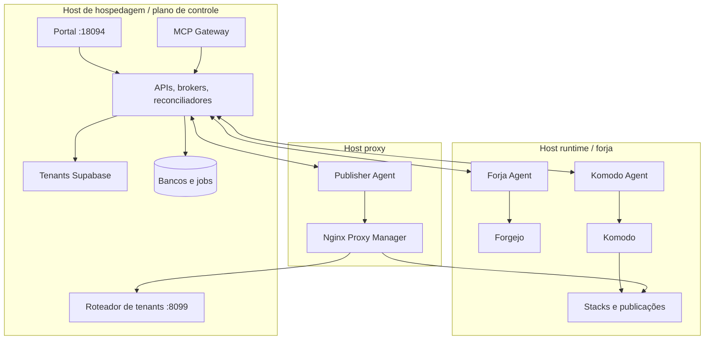

# Arquitetura

## Visão lógica

## Distribuição física

## Fronteiras de responsabilidade

| Camada | Responsabilidade |
|---|---|
| Portal | Experiência humana, validação de formulário, acompanhamento e ações diretas. |
| MCP Gateway | Protocolo MCP, OAuth, descoberta de ferramentas e identidade do agente. |
| Brokers | Planos e efeitos controlados para build, deploy, preview, workspace e Supabase. |
| Registro de agentes | Client ID, hash do segredo, escopos, projeto e limites. |
| Aprovações | Decisões humanas para ações protegidas e ativação de produção. |
| Reconciliação | Comparar estado desejado e observado e executar correções idempotentes. |
| Agentes runtime | Adaptar APIs centrais a Forgejo, Komodo, Docker e filesystem local. |
| Proxy | Publicar rotas, certificados e nomes estáveis/versionados. |
| Tenants Supabase | Banco, Auth, REST, Storage, Realtime, Studio e serviços auxiliares por tenant. |

## Runtime de cada projeto

Cada projeto novo possui um container exclusivo com Apache, PHP e Node.js. As imagens-base são compartilhadas por combinação de versões; os processos e arquivos do projeto não são compartilhados. O proxy público termina TLS em 80/443 e encaminha HTTP interno para a porta 80 do Apache.
