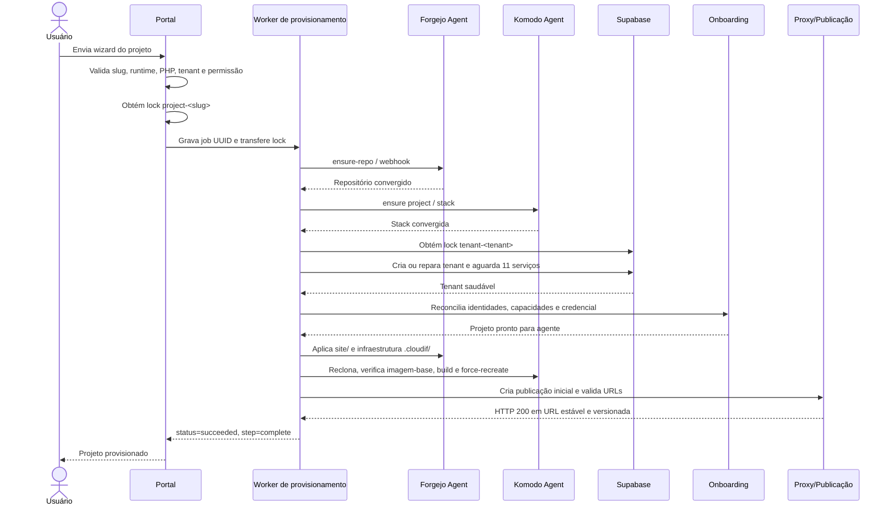
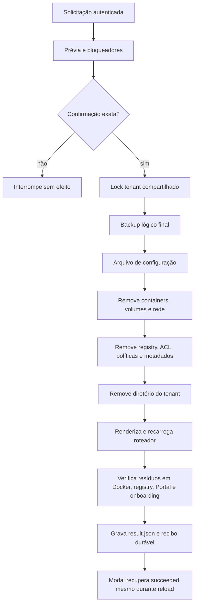
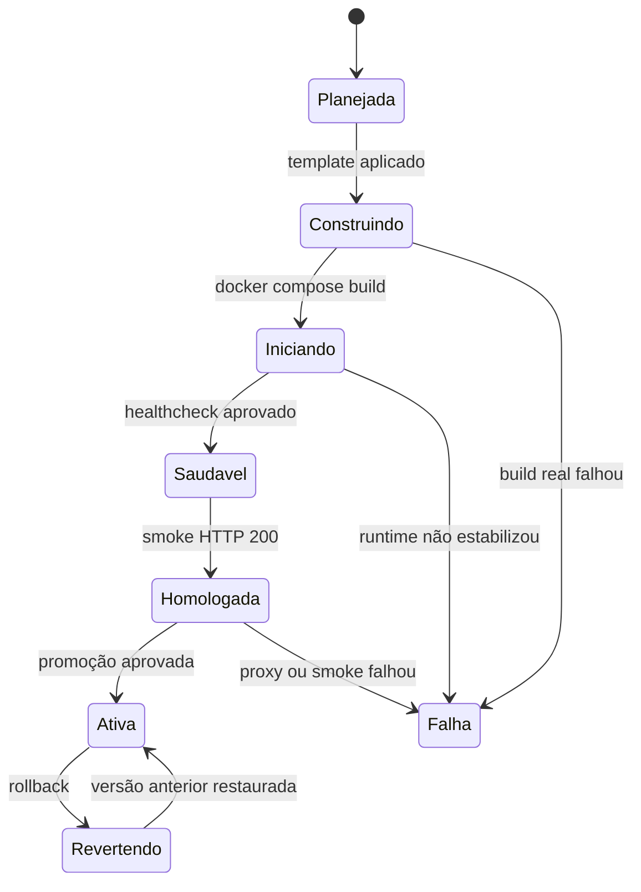

# Fluxos de processo

## Criação e provisionamento de projeto

## Exclusão de tenant

## Publicação

## Fluxos atuais complementares

Os fluxos de ACL, terminal compartilhado, publicação versionada e exclusão derivada estão detalhados em [Arquitetura operacional atual](12-ARQUITETURA-OPERACIONAL-ATUAL.md). Esse capítulo deve ser considerado o contrato vigente para integrações entre Portal, Forja Agent, Komodo Agent, Publisher e Tenant Guard.
