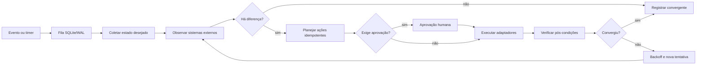
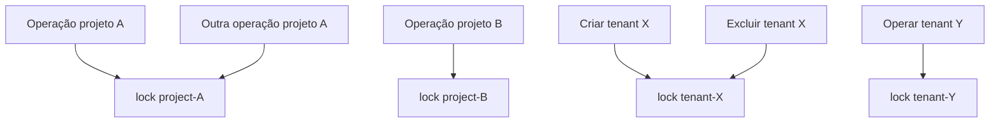

# Protocolos de reconciliação

Reconciliação é o mecanismo que compara o estado desejado registrado pela CloudIFF com o estado observado em Forgejo, Komodo, Supabase, proxy e publicações.

## Modelo

## Tipos de evento

- `project.created` e `project.updated`;
- `project.membership.changed` para inclusão ou remoção em projeto;
- `tenant.membership.changed` para inclusão ou remoção em banco;
- mudanças de tenant;
- publicação e promoção;
- rotação de credencial;
- divergência detectada por timer;
- transação interrompida;
- mudança de certificado ou proxy.

## Reconciliação de membros

Eventos de membresia carregam a identificação do projeto ou tenant, mas o worker consulta o estado desejado completo antes de agir. Isso evita divergências quando duas mudanças acontecem em sequência ou quando uma tentativa é repetida.

| Vínculo alterado | Recursos reconciliados |
|---|---|
| Projeto | Colaborador do Forgejo, permissões do Komodo, terminais de todas as publicações `dN` e integrações MCP. |
| Banco | Listas e permissões de acesso ao tenant Supabase. |
| Remoção | Somente recursos individuais gerenciados pela CloudIFF; proprietário e vínculos externos ficam preservados. |

Falhas transitórias usam retry e backoff. A ACL salva no Portal permanece como fonte do estado desejado até todos os sistemas convergirem.

## Idempotência

Uma ação idempotente pode ser repetida sem duplicar recursos. Exemplos:

- `ensure-repo` cria o repositório somente quando falta;
- `ensure-webhook` compara e corrige o webhook;
- `ensure tenant` repara diretório incompleto e aguarda serviços;
- `deploy-full` reclona e recria a stack de forma controlada;
- renderização do roteador substitui a configuração derivada do registry.

## Concorrência

Projetos e tenants diferentes continuam paralelos. O mesmo recurso é serializado.
