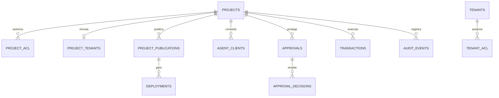

# Modelo de dados e dicionário

A CloudIFF usa bancos SQLite separados por domínio para reduzir acoplamento e permitir backup/restauração independentes.

## Mapa de bancos

| Banco | Caminho operacional típico | Conteúdo |
|---|---|---|
| Portal | `/var/lib/cloudif/portal/cloudif-portal.db` | Projetos, ACL, tenants, publicações, configurações e auditoria do Portal. |
| Controle | `/var/lib/cloudif/control-plane/control-plane.db` | Estado agregado do plano de controle. |
| Agentes | `/var/lib/cloudif/agents/agents.db` | Clientes, hashes de segredo, escopos e limites. |
| Aprovações | `/var/lib/cloudif/approvals/approvals.db` | Solicitações, decisões e aprovadores. |
| Auditoria | `/var/lib/cloudif/audit/audit.db` | Eventos técnicos e acadêmicos. |
| Monitoramento | `/var/lib/cloudif/monitoring/monitor.db` | Métricas e observações. |
| Notificações | `/var/lib/cloudif/notifications/notifications.db` | Alertas, severidade e estado. |
| Avaliações | `/var/lib/cloudif/evaluations/evaluations.db` | Resultados de avaliações automatizadas. |
| Onboarding | `/var/lib/cloudif/onboarding/onboarding.db` | Identidade MCP e estado de onboarding por projeto. |

## Entidades principais

## Campos conceituais

### `projects`

| Campo | Finalidade |
|---|---|
| `slug` | Identificador imutável e chave única do projeto. |
| `name` | Nome de exibição. |
| `owner` | Proprietário responsável. |
| `tenant` | Tenant Supabase vinculado. |
| `repo_url` | Endereço do repositório Forgejo. |
| `komodo_status` | Estado observado da stack. |
| `description` | Contexto acadêmico ou funcional. |

### `project_publications`

| Campo | Finalidade |
|---|---|
| `project_slug` | Projeto publicado. |
| `public_number` | Número público estável. |
| `deploy_number` | Versão/deploy incremental. |
| `stable_hostname` | URL estável. |
| `version_hostname` | URL versionada. |
| `status` | Estado do deploy. |
| `is_active` | Marca a versão ativa. |

### `approvals`

| Campo | Finalidade |
|---|---|
| `approval_id` | Identificador da solicitação. |
| `project_slug` | Escopo do projeto. |
| `action` | Operação protegida. |
| `requester` | Agente ou usuário solicitante. |
| `status` | Pendente, aprovada, negada ou expirada. |
| `required_approvals` | Quantidade de decisões necessárias. |
| `expires_at` | Limite para uso da decisão. |
