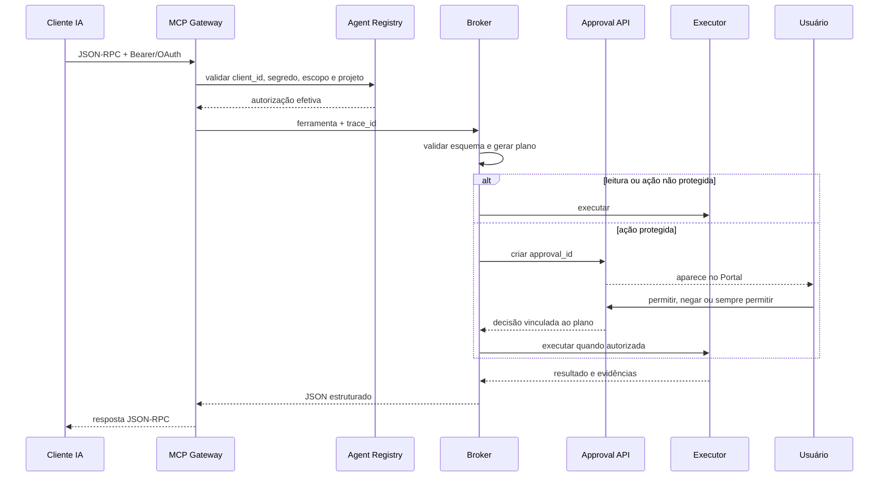

# Mensagens, aprovações e segurança

## Transporte de uma solicitação de agente

## Aceitação e rejeição

Uma decisão só é válida quando corresponde ao projeto, ação, solicitante, ambiente, hash do plano e prazo. A ativação real de produção exige dois aprovadores distintos e o solicitante não pode aprovar a própria ativação.

A opção **sempre permitir** deve criar uma regra revogável e específica, nunca uma permissão global implícita. A regra é avaliada antes de abrir uma nova solicitação e deve ser registrada na auditoria.

## OAuth e MCP

- Discovery: `/.well-known/oauth-authorization-server`.
- Recurso protegido: `/.well-known/oauth-protected-resource/cloudiff/mcp`.
- Authorization code com PKCE S256.
- Client ID é a identidade do agente/projeto.
- Client Secret é a chave gerada no Portal.
- Access token é temporário; refresh token é revogável.
- Token direto MCP continua suportado para clientes simples.
