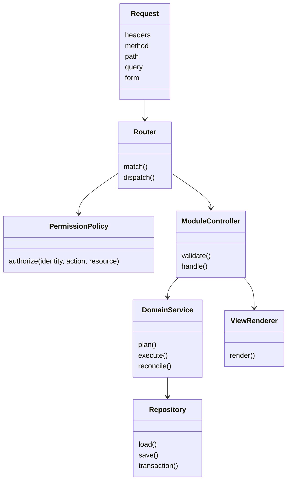

# Modelo de software e responsabilidades

A implementação do Portal está em transição de um arquivo-base legado para módulos com rotas, permissões, serviços e UI separados.

## Modelo–Visão–Controle

- **Modelo**: SQLite, registries, jobs JSON, relatórios e estado observado dos agentes.
- **Visão**: renderizadores HTML/CSS/JS do Portal e respostas JSON das APIs.
- **Controle**: handlers HTTP, módulos de ação, brokers e workers.
- **Adaptadores**: Forja Agent, Komodo Agent, Supabase scripts e proxy agent.

A interface web e o agente de IA permanecem independentes: ambos usam serviços de domínio, mas possuem autenticação, rotas e tratamento de interação separados.
