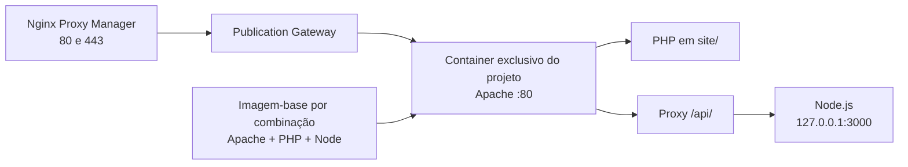
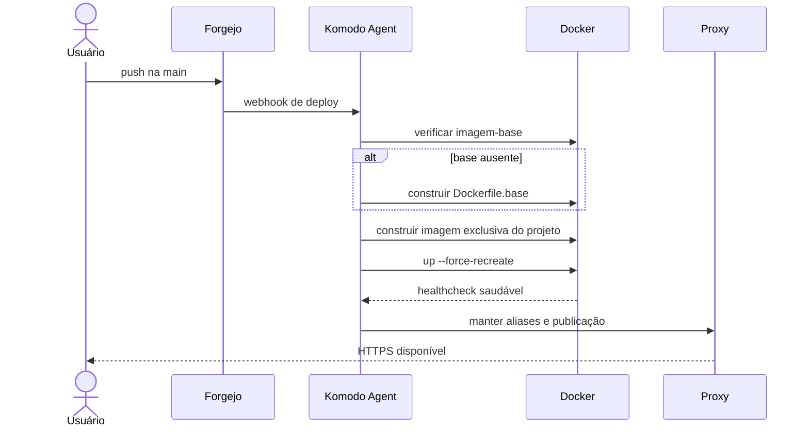

# Runtime unificado de projetos

## Objetivo

Cada projeto novo executa em um **container isolado**, enquanto imagens-base são compartilhadas por combinação de versões. Isso preserva isolamento entre usuários e reaproveita as camadas pesadas de Apache, PHP, Node.js e extensões.

## Composição



## Superfície do repositório

```text
README.md
site/
  index.php
  api/
    server.js
    package.json
.cloudif/
  Dockerfile
  Dockerfile.base
  docker-compose.yml
  apache-vhost.conf
  supervisor.conf
  node-runner.sh
  health.php
  runtime.json
  .env
```

O usuário trabalha normalmente em `site/`. A pasta `.cloudif/` é versionada, porém gerenciada pela plataforma.

## Versionamento

Combinações homologadas atuais:

| Componente | Versões |
|---|---|
| Node.js | 20, 22 e 24 |
| PHP | 8.2, 8.3 e 8.4 |
| Apache | 2.4 da imagem oficial PHP selecionada |

A imagem-base segue o padrão:

```text
cloudif/runtime-apache-php<versão>-node<versão>:v1
```

Exemplo:

```text
cloudif/runtime-apache-php8.3-node22:v1
```

## Publicação



## Contrato obrigatório

- serviço público chamado `web`;
- Apache interno na porta 80;
- endpoint `/.cloudif-health` saudável;
- rede externa `cloudif-publications`;
- aliases estável e versionado;
- PHP servido a partir de `site/`;
- Node opcional em `site/api/server.js`;
- TLS terminado no proxy, não dentro do container.

## Exclusão

A exclusão de projeto remove publicação, stack, container, imagem do projeto, repositório e metadados, mas preserva o tenant. A exclusão de tenant é um fluxo independente, com lock, backup final e verificação de resíduos.
