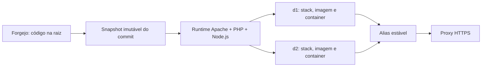

# Runtime gerenciado de projetos

A CloudIFF mantém o código-fonte separado da infraestrutura. O repositório do usuário contém apenas a aplicação; Dockerfile, Compose, Apache, Supervisor, healthcheck, imagens e metadados são gerados pela plataforma fora do Git.



## Estrutura do repositório

```text
index.php ou index.html
api/
  server.js
  package.json
assets/
src/
README.md
```

A raiz do repositório é a raiz da aplicação. Não existe uma pasta obrigatória `site/`. APIs Node opcionais ficam em `api/` e são expostas em `/api/`.

Os seguintes arquivos não pertencem ao repositório do projeto:

- `.cloudif/`;
- `docker-compose.yml`, `compose.yaml` ou equivalentes da plataforma;
- Dockerfiles gerados pela CloudIFF;
- `.env`, tokens e segredos;
- configuração de Apache, Supervisor ou healthcheck da plataforma.

## Runtime externo ao Git

A plataforma registra as versões de PHP e Node selecionadas no estado interno do projeto. Para cada publicação, ela:

1. resolve o commit imutável no Forgejo;
2. cria um snapshot em `/srv/cloudif/publications/p<numero>/d<versao>/source`;
3. gera o Dockerfile e o Compose fora do Git;
4. cria uma imagem `cloudif/publication-p<numero>-d<versao>:php<php>-node<node>`;
5. cria a stack `cloudif-p<numero>-d<versao>`;
6. cria o container `cloudif-p<numero>-d<versao>-web`;
7. valida o healthcheck antes de permitir a ativação.

A imagem-base compartilhada segue o padrão `cloudif/runtime-apache-php8.3-node22:v2`, ajustado às versões escolhidas.

## Publicações independentes

Cada `dN` possui recursos próprios. Ativar uma versão move somente o alias interno `cloudif-p<numero>-active-web`; os containers das demais versões não são reutilizados como se fossem a mesma publicação.

Quando um container antigo estiver ausente, a ativação reconstrói o commit registrado daquela versão, valida a saúde e só então move o alias.

## Membros e permissões

Inclusões e remoções em projeto ou banco geram eventos de reconciliação. O estado completo atual é reaplicado em:

- colaboradores do Forgejo;
- permissões do Komodo;
- terminais individuais em todas as publicações existentes;
- listas de acesso do tenant Supabase;
- integrações e identidade MCP do projeto.

A remoção elimina apenas recursos que a CloudIFF gerenciou para aquele vínculo. O proprietário do projeto ou tenant continua protegido.

## Rede e HTTPS

Os containers atendem internamente na porta 80 e participam da rede `cloudif-publications`. O TLS é terminado no proxy público, que encaminha o endereço estável para o alias da versão ativa.
