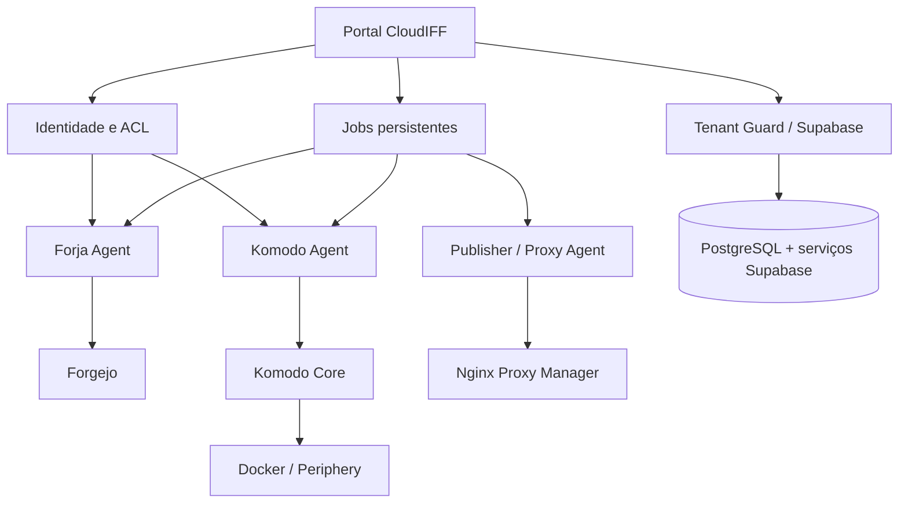
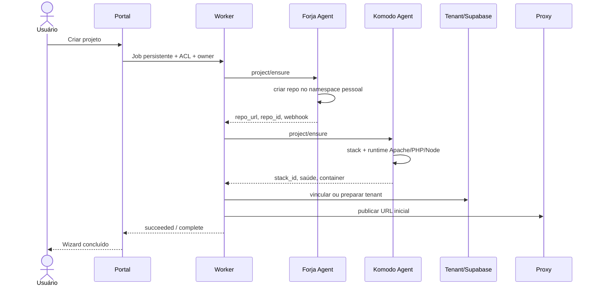
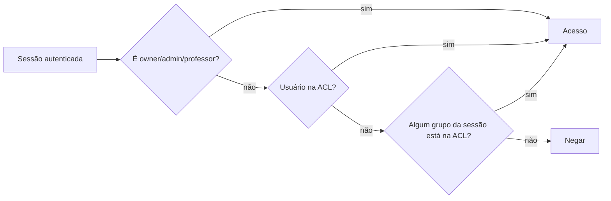
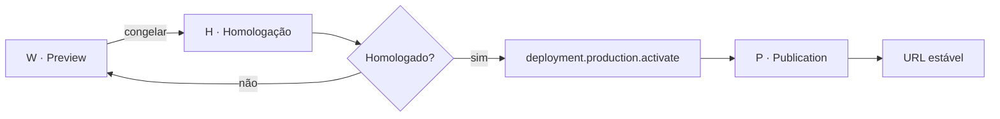
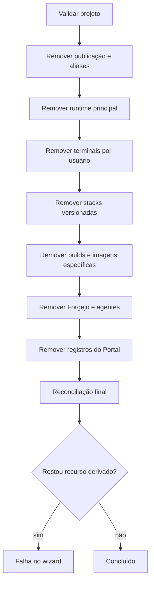

# Arquitetura operacional atual

Este capítulo consolida o comportamento implementado em produção para provisionamento, ACL, publicação, terminal, reconciliação e exclusão. Ele complementa os capítulos anteriores e representa o contrato operacional vigente.

## Modelo em camadas



### Camada de experiência

O Portal apresenta projetos, publicações, bancos, backups, conectores, permissões, ajuda e operações administrativas. Ele nunca deve tratar uma operação longa como concluída apenas por ter enviado a requisição: jobs persistentes e wizards consultam o estado real.

### Camada de controle

O plano de controle mantém projetos, ACLs, integrações, publicações, aliases, jobs e auditoria. Locks por projeto impedem efeitos concorrentes sobre o mesmo recurso.

### Camada de agentes

Os agentes adaptam contratos do plano de controle aos sistemas externos. Eles operam com idempotência, respostas estruturadas e reconciliação do estado observado.

### Camada de execução

Komodo, Docker e Periphery executam stacks do projeto, publicações e tenants. Cada projeto usa runtime isolado; imagens-base podem ser compartilhadas, mas processos, arquivos e redes permanecem separados.

## Agentes e responsabilidades

| Agente | Entrada principal | Responsabilidade | Resultado esperado |
|---|---|---|---|
| Forja Agent | `/project/ensure`, `/project/rollback` | Repositório pessoal, webhook, arquivos, commits e remoção | Repositório no owner correto e automação única |
| Komodo Agent | `/komodo/project/ensure`, `/audit`, `/runtime-info`, `/terminal/ensure`, `/stack/destroy` | Stack, runtime, terminal, publicação, ACL e limpeza | Estado real reconciliado com o Portal |
| Publisher Agent | publicação e promoção | Host versionado, certificado, alias estável e promoção | URL versionada e estável em HTTP 200 |
| Tenant Guard | abertura e warmup | Inicialização, autorização e estabilidade do tenant | Banco/API disponíveis antes do redirecionamento |
| Backup workers | timers e ações manuais | Backups de projeto, tenant e plataforma | Artefato auditável e política de retenção |
| Reconcile workers | filas, timers e paths | Reparar divergências e retomar operações | Estado convergente ou falha explícita |

## Provisionamento



O provisionador envia `owner` e ACL completa. O repositório é criado no namespace do solicitante. O Komodo recebe os mesmos vínculos e aplica permissões à stack principal, às publicações e à stack do tenant.

## ACL de usuários e grupos

Uma ACL possui entradas `user` ou `group`. Pertencer ao grupo geral de alunos não concede acesso automático a projetos de terceiros. Um grupo só herda acesso quando foi adicionado explicitamente à ACL do projeto.



A sincronização aplica permissões a:

- repositório Forgejo;
- stack principal;
- stacks de publicações;
- stack do tenant/Supabase;
- terminais autorizados.

## Publicação W → H → P

O ciclo vigente usa três estágios explícitos:

- **W · Preview:** workspace Git local montado em um container vivo. Alterações aparecem sem criar release.
- **H · Homologação:** snapshot imutável de código + runtime, com diff, digest e homologadores do projeto.
- **P · Publicação:** novo container criado a partir do mesmo digest de H, com configuração Production e ativação controlada.



A propriedade de segurança/qualidade do fluxo é:

```text
imagem/digest homologado em H == imagem/digest executado em P
```

Não há rebuild entre H e P. A Produção continua sujeita à autorização crítica e, quando aplicável, à dupla aprovação. O rollback reativa uma P anterior saudável em vez de reconstruí-la.

Os hostnames públicos seguem os formatos:

```text
<numero>-w<N>-preview.cloudiff.duckdns.org
<numero>-h<N>-homologation.cloudiff.duckdns.org
<numero>-p<N>-publication.cloudiff.duckdns.org
<numero>.cloudiff.duckdns.org              # P ativa
```

`dN` permanece como identificador técnico/legado para compatibilidade com publicações históricas e detalhes internos. Veja o contrato completo em [Fluxo W → H → P de publicação](../FLUXO-WHP-PUBLICACAO.md).


## Terminal do projeto

O Portal envia ao Komodo o usuário autenticado, seus grupos, owner e ACL. Quando W existe e está saudável, o terminal padrão é aberto no **container Preview W**; projetos ainda não migrados usam o fluxo legado de compatibilidade. Isso mantém desenvolvimento, personalização de runtime e visualização no mesmo ambiente sem reutilizar a identidade do owner nem conceder leitura global do servidor.

A tela global **Containers** permanece restrita porque o Komodo 2.2.0 exige leitura do servidor inteiro. Recursos autorizados aparecem em **Stacks** e **Terminals**.

## Exclusão de projeto

A exclusão é idempotente e rastreia recursos derivados pelo slug, número público, IDs, labels e alvos dos terminais.



São removidos terminais, publicações, builds, imagens específicas, snapshots, stacks versionadas, stack principal, repositório e registros do Portal. O tenant e os dados Supabase são preservados quando a política de exclusão do projeto determina preservação do banco.

## Mensagens principais

| Mensagem/endpoint | Emissor | Consumidor | Finalidade |
|---|---|---|---|
| `project/ensure` | Worker/Forja Agent | Forgejo/Komodo | Criar ou reconciliar projeto |
| `project/rollback` | Exclusão administrativa | Forja Agent | Remover repositório e automação |
| `komodo/project/audit` | Portal | Komodo Agent | Estado real de stack/container |
| `komodo/project/runtime-info` | Portal | Komodo Agent | Diagnóstico PHP e Node |
| `komodo/project/terminal/ensure` | Portal | Komodo Agent | Terminal legado/compatível do usuário autenticado |
| `komodo/project/preview/terminal` | Portal | Komodo Agent | Terminal do Preview W saudável |
| `komodo/project/preview/snapshot` | Portal | Komodo Agent | Congelar W em candidato H |
| `komodo/publication/deploy` | Publicador | Komodo Agent | Criar versão imutável |
| `komodo/publication/promote` | Publicador | Komodo Agent | Promoção técnica legada `dN` |
| `komodo/publication/release` | Portal/Publicador | Komodo Agent | Criar P a partir do mesmo digest homologado em H |
| `komodo/publication/release/activate` | Portal/Publicador | Komodo Agent | Reativar P imutável em rollback |
| `komodo/stack/destroy` | Exclusão | Komodo Agent | Limpeza principal e derivada |

## Princípios de segurança

- Tokens permanecem fora do repositório e das respostas do Portal.
- ACL de grupo só vale quando explicitamente associada ao projeto.
- Falhas transitórias podem ser reconciliadas, mas não mascaradas.
- Uma operação só termina quando o estado observado confirma o efeito.
- A exclusão falha se recursos derivados permanecerem.
- Recursos compartilhados de runtime e dados preservados não são removidos por uma exclusão de projeto.
